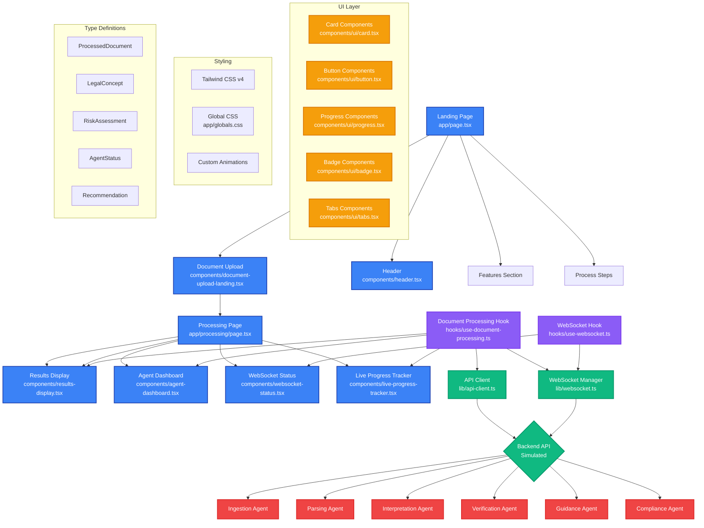

```mermaid
graph TB
    %% Main Application Flow
    Landing[Landing Page<br/>app/page.tsx] --> Upload[Document Upload<br/>components/document-upload-landing.tsx]
    Upload --> Processing[Processing Page<br/>app/processing/page.tsx]
    Processing --> Results[Results Display<br/>components/results-display.tsx]

    %% Landing Page Components
    Landing --> Header[Header<br/>components/header.tsx]
    Landing --> Features[Features Section]
    Landing --> ProcessSteps[Process Steps]

    %% Processing Page Layout
    Processing --> AgentDash[Agent Dashboard<br/>components/agent-dashboard.tsx]
    Processing --> WSStatus[WebSocket Status<br/>components/websocket-status.tsx]
    Processing --> LiveTracker[Live Progress Tracker<br/>components/live-progress-tracker.tsx]
    Processing --> Results

    %% Data Layer
    ApiClient[API Client<br/>lib/api-client.ts] --> Backend{Backend API<br/>Simulated}
    WSManager[WebSocket Manager<br/>lib/websocket.ts] --> Backend
    
    %% Hooks Layer
    DocHook[Document Processing Hook<br/>hooks/use-document-processing.ts] --> ApiClient
    DocHook --> WSManager
    WSHook[WebSocket Hook<br/>hooks/use-websocket.ts] --> WSManager

    %% State Flow
    DocHook --> AgentDash
    DocHook --> LiveTracker
    WSHook --> WSStatus
    DocHook --> Results

    %% Multi-Agent System
    Backend --> Agent1[Ingestion Agent]
    Backend --> Agent2[Parsing Agent]
    Backend --> Agent3[Interpretation Agent]
    Backend --> Agent4[Verification Agent]
    Backend --> Agent5[Guidance Agent]
    Backend --> Agent6[Compliance Agent]

    %% UI Components
    subgraph "UI Layer"
        Card[Card Components<br/>components/ui/card.tsx]
        Button[Button Components<br/>components/ui/button.tsx]
        Progress[Progress Components<br/>components/ui/progress.tsx]
        Badge[Badge Components<br/>components/ui/badge.tsx]
        Tabs[Tabs Components<br/>components/ui/tabs.tsx]
    end

    %% Styling
    subgraph "Styling"
        TailwindCSS[Tailwind CSS v4]
        GlobalCSS[Global CSS<br/>app/globals.css]
        Animations[Custom Animations]
    end

    %% Data Models
    subgraph "Type Definitions"
        ProcessedDoc[ProcessedDocument]
        LegalConcept[LegalConcept]
        RiskAssess[RiskAssessment]
        AgentStatus[AgentStatus]
        Recommendation[Recommendation]
    end

    %% Colors and Styling
    classDef component fill:#3b82f6,stroke:#1e40af,stroke-width:2px,color:#fff
    classDef hook fill:#8b5cf6,stroke:#7c3aed,stroke-width:2px,color:#fff
    classDef api fill:#10b981,stroke:#059669,stroke-width:2px,color:#fff
    classDef ui fill:#f59e0b,stroke:#d97706,stroke-width:2px,color:#fff
    classDef agent fill:#ef4444,stroke:#dc2626,stroke-width:2px,color:#fff

    class Landing,Upload,Processing,Results,AgentDash,WSStatus,LiveTracker,Header component
    class DocHook,WSHook hook
    class ApiClient,WSManager,Backend api
    class Card,Button,Progress,Badge,Tabs ui
    class Agent1,Agent2,Agent3,Agent4,Agent5,Agent6 agent
```